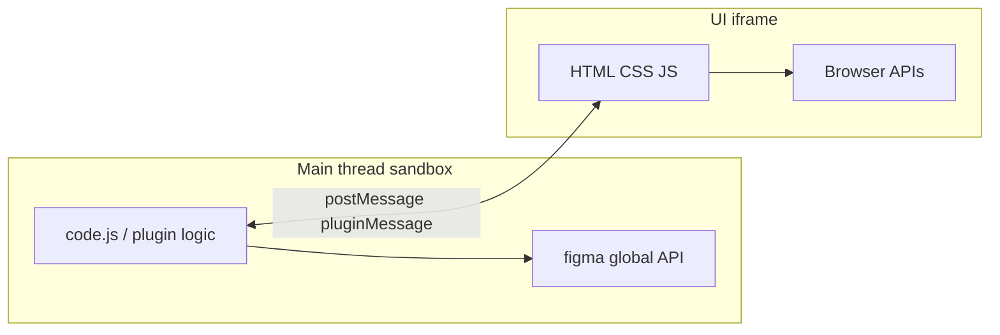

# Figma plugin builder

End-to-end guidance for **standalone Figma plugins** (local project, manifest, UI, ship) and for **AI-assisted file work** via the Figma MCP `use_figma` tool. The Plugin API is the same; the **runtime rules differ** (see §8).

**Official docs (source of truth for API changes):** [Plugin API / guides](https://developers.figma.com/docs/plugins/).

**Bundled references:** deep patterns and full typings live in [`references/`](references/) (vendored from [figma/mcp-server-guide — `figma-use`](https://github.com/figma/mcp-server-guide/tree/main/skills/figma-use)). New distilled guides: [plugin-setup-and-manifest.md](references/plugin-setup-and-manifest.md), [plugin-ui-and-theming.md](references/plugin-ui-and-theming.md), [dev-mode-and-codegen.md](references/dev-mode-and-codegen.md), [network-and-security.md](references/network-and-security.md).

---

## 1. Quick start

| You are… | Start here |
| --- | --- |
| **New plugin repo** | [plugin-setup-and-manifest.md](references/plugin-setup-and-manifest.md) → Figma **Plugins → Development → New plugin** → `npm install` → watch TS → run from **Development** menu |
| **Custom UI** | [plugin-ui-and-theming.md](references/plugin-ui-and-theming.md) — `figma.showUI`, `themeColors`, `postMessage` |
| **Dev Mode / VS Code / codegen** | [dev-mode-and-codegen.md](references/dev-mode-and-codegen.md) |
| **fetch / APIs / CSP** | [network-and-security.md](references/network-and-security.md) |
| **API shape / grep types** | [plugin-api-standalone.index.md](references/plugin-api-standalone.index.md) + grep [plugin-api-standalone.d.ts](references/plugin-api-standalone.d.ts) |
| **MCP / `use_figma` in chat** | §8 below + [validation-and-recovery.md](references/validation-and-recovery.md) |

**Design systems in files:** start [working-with-design-systems/wwds.md](references/working-with-design-systems/wwds.md), then variables/components/style refs as needed.

---

## 2. Plugin architecture



- **Main thread:** Plugin API (`figma`), scene graph, no DOM/`fetch` in the sandbox **as browser** — use Figma’s APIs (including plugin [Fetch](https://developers.figma.com/docs/plugins/api/properties/global-fetch/) from main per docs).
- **UI iframe:** DOM, `postMessage` to parent. **Cannot** read the document tree directly.
- **Bridge:** `figma.ui.postMessage` / `figma.ui.onmessage` (main) and `parent.postMessage({ pluginMessage: ... }, '*')` (UI). See [plugin-ui-and-theming.md](references/plugin-ui-and-theming.md).
- **End exit:** Real plugins must call `figma.closePlugin()` when finished or users see a stuck run state ([how plugins run](https://developers.figma.com/docs/plugins/how-plugins-run/)).

---

## 3. Project setup

Summarized in [plugin-setup-and-manifest.md](references/plugin-setup-and-manifest.md).

- **Desktop app** required for loading local plugin folders.
- **TypeScript** recommended; `main` in manifest points to **compiled JS**.
- **Watch:** e.g. VS Code build task / `tsc -w` per template.
- **Lint:** `@figma/eslint-plugin-figma-plugins` + TypeScript ESLint.
- **Typings:** `@figma/plugin-typings` (or rely on vendored `plugin-api-standalone.d.ts` for exploration).
- **Samples:** [figma/plugin-samples](https://github.com/figma/plugin-samples) (esbuild/webpack/React, variables, dev mode, etc.).

---

## 4. manifest.json essentials

Full field reference: [plugin-setup-and-manifest.md](references/plugin-setup-and-manifest.md) and [official manifest](https://developers.figma.com/docs/plugins/manifest/).

**Always include for new plugins:**

```json
"documentAccess": "dynamic-page"
```

**Pair with real usage:**

- `editorType` — `figma`, `figjam`, `dev`, `slides`, `buzz` (note unsupported combos in docs).
- `networkAccess` — lock to domains you actually request.
- `permissions` — `currentuser`, `activeusers`, `teamlibrary`, `payments`, `fileusers` as needed.
- `capabilities` — `inspect`, `codegen`, `vscode`, `textreview` for specialized Dev Mode / editor features.

---

## 5. Plugin UI

- `figma.showUI(__html__, { themeColors: true, width, height })` for native-aligned theming.
- Use **CSS variables** (`--figma-color-*`) for light/dark — see [plugin-ui-and-theming.md](references/plugin-ui-and-theming.md) and [CSS variables doc](https://developers.figma.com/docs/plugins/css-variables/).
- **Drag-drop to canvas:** `pluginDrop` message shape — same reference + [Creating UI](https://developers.figma.com/docs/plugins/creating-ui/).

---

## 6. Critical API rules (shared semantics)

These apply to **normal plugins** and to logically correct Plugin API code in general. For **MCP `use_figma`**, see extra constraints in §8.

| Rule | Detail |
| --- | --- |
| Colors | RGB **0–1** floats, not 0–255 |
| Fills / strokes | Treat as **read-only** — clone arrays, edit, reassign |
| Fonts | `await figma.loadFontAsync(...)` before creating/editing text |
| Pages | Files load **incrementally** — navigate pages explicitly; use async APIs for off-page nodes ([accessing document](https://developers.figma.com/docs/plugins/accessing-document/)) |
| Auto-layout sizing | Often set `FILL` / `HUG` **after** `appendChild` where applicable |
| Variables | Prefer explicit `scopes` when creating variables ([variable-patterns.md](references/variable-patterns.md)) |
| Async | **Await** plugin async APIs — avoid fire-and-forget |

**WRONG/CORRECT examples:** [gotchas.md](references/gotchas.md), [plugin-api-patterns.md](references/plugin-api-patterns.md).

---

## 7. Incremental workflow (quality bar)

Whether you ship a plugin or prototype in a file:

1. **Inspect** existing pages, naming, variables, components.
2. **One focused change** per logical step (especially across MCP rounds).
3. **Return or log structured results** — IDs, counts (MCP: see §8).
4. **Validate** structure before big visual assumptions; fix before layering more changes.

For MCP + metadata/screenshots, see [validation-and-recovery.md](references/validation-and-recovery.md).

---

## 8. MCP integration (`use_figma`)

When the environment exposes Figma MCP **`use_figma`**, agents run Plugin API **JavaScript inside the file context** via the server — not your local `code.js`.

**Before any `use_figma` call:** load this skill (and follow [figma/mcp-server-guide](https://github.com/figma/mcp-server-guide) if you install their skill pack). If your server requires a logging tag, pass it exactly as documented (upstream examples use `skillNames: "figma-use"` — **telemetry only**, does not change execution).

**Full-page / design-system assembly from code:** consider also loading Figma’s companion skill **`figma-generate-design`** from the same MCP guide repo for `search_design_system` + incremental screen build workflows.

### MCP-only / hosted-runtime constraints (from upstream `figma-use`)

Adapted from [figma-use SKILL.md](https://github.com/figma/mcp-server-guide/blob/main/skills/figma-use/SKILL.md):

1. Use **`return`** to send data out — do **not** call `figma.closePlugin()` or wrap in an async IIFE; the host wraps execution.
2. Write **top-level** `await` + `return` as plain JS in the tool payload.
3. **`figma.notify()`** — unsupported in `use_figma` (throws “not implemented”) — use `return` for feedback.
4. **`getPluginData` / `setPluginData`** — unsupported; prefer **`getSharedPluginData` / `setSharedPluginData`** or return IDs between calls.
5. **`console.log`** — not surfaced as tool output; use **`return`**.
6. **Pages:** at the start of each call, default page may reset — use `await figma.setCurrentPageAsync(page)` when targeting non-first pages. **Sync** `figma.currentPage = page` **throws** in this runtime.
7. **Errors are atomic** — failed script applies **no** mutations; read error, fix, retry (no blind immediate retry).
8. **Return all created/mutated node IDs** for follow-up tool calls.
9. **FigJam vs design** node availability — see upstream §4 ( design vs FigJam node sets ).

> **Standalone plugins** differ: you **do** use `figma.closePlugin()`, bundle `ui.html`, and use normal plugin lifecycle.

---

## 9. Dev Mode plugins

Read-only document constraints, Inspect layout, codegen, VS Code: [dev-mode-and-codegen.md](references/dev-mode-and-codegen.md).

---

## 10. Pre-flight checklist

**Shipping a local plugin**

- [ ] `documentAccess: "dynamic-page"`
- [ ] `networkAccess` matches all `fetch` / image URLs / websockets
- [ ] Fonts loaded before text operations
- [ ] UI uses `themeColors` + tokens if you want native light/dark
- [ ] `postMessage` uses `pluginMessage` envelope
- [ ] `figma.closePlugin()` on completion paths (and error paths where appropriate)
- [ ] Dev Mode: no illegal scene mutations; responsive Inspect UI

**MCP `use_figma`**

- [ ] Top-level `return` with actionable payload
- [ ] No `figma.closePlugin()` / no async IIFE wrapper
- [ ] No `figma.notify`
- [ ] Page switched with `setCurrentPageAsync` if needed
- [ ] IDs returned for creates/mutates
- [ ] On error: stop, read message, fix, then retry

---

## 11. Publishing and support

- **Community publish** — follow current Figma flow from the desktop app; manifest `id` ties versions together.
- **Versioning** — updates go to all users; plan rollback by re-publishing a known-good bundle.
- **Disclosure** — security / data practices forms when required by Figma.
- **Support** — you own user-facing support for third-party plugins.
- **Analytics** — Figma does not ship plugin analytics; use your own telemetry if needed.

Links: [Manage plugins as a developer](https://help.figma.com/hc/en-us/articles/360042293714), [Introduction / limitations](https://developers.figma.com/docs/plugins/).

---

## 12. Reference docs (this folder)

| Doc | When to load |
| --- | --- |
| [plugin-setup-and-manifest.md](references/plugin-setup-and-manifest.md) | Scaffold, manifest fields, editor types |
| [plugin-ui-and-theming.md](references/plugin-ui-and-theming.md) | UI, themes, messaging, drag-drop |
| [dev-mode-and-codegen.md](references/dev-mode-and-codegen.md) | `editorType: dev`, inspect/codegen, VS Code |
| [network-and-security.md](references/network-and-security.md) | fetch, CSP, `networkAccess` testing |
| [gotchas.md](references/gotchas.md) | Pitfalls with WRONG/CORRECT samples |
| [common-patterns.md](references/common-patterns.md) | Copy-paste scaffolds |
| [plugin-api-patterns.md](references/plugin-api-patterns.md) | Fills, layout, effects, grouping |
| [api-reference.md](references/api-reference.md) | Curated API surface notes |
| [component-patterns.md](references/component-patterns.md) | Components, variants, instances |
| [variable-patterns.md](references/variable-patterns.md) | Variables, modes, bindings |
| [text-style-patterns.md](references/text-style-patterns.md) | Text styles, fonts |
| [effect-style-patterns.md](references/effect-style-patterns.md) | Effect styles |
| [validation-and-recovery.md](references/validation-and-recovery.md) | MCP validation / recovery |
| [plugin-api-standalone.index.md](references/plugin-api-standalone.index.md) | API index |
| [plugin-api-standalone.d.ts](references/plugin-api-standalone.d.ts) | Full typings — **grep**, don’t load whole file into chat |
| [working-with-design-systems/wwds.md](references/working-with-design-systems/wwds.md) | Design-system workflow |

---

## Refresh vendored references

To update typings/patterns from upstream:

```bash
git clone --depth 1 https://github.com/figma/mcp-server-guide.git /tmp/mcp-server-guide
cp -R /tmp/mcp-server-guide/skills/figma-use/references/* figma-plugin-builder/references/
# re-apply the four distilled docs if you edit them: plugin-setup-and-manifest, plugin-ui-and-theming, dev-mode-and-codegen, network-and-security
```

---

## License note

Files under `references/` from `figma/mcp-server-guide` follow that repository’s license; use and redistribution per upstream terms. Official Figma documentation is © Figma — link to live docs for the latest text.
