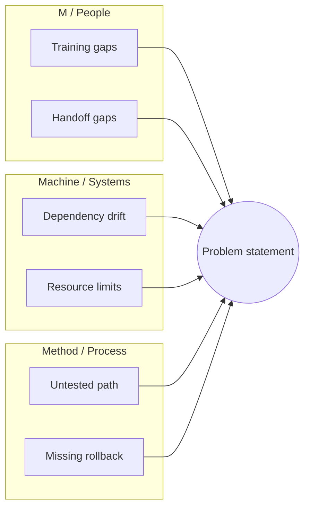
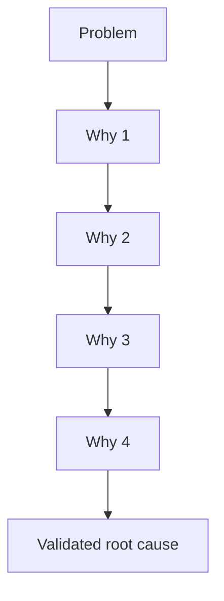

# Root cause analysis — reference

This file expands [SKILL.md](SKILL.md): classical RCA methods **grounded in** mechanism, violated invariant, and evidence—not brainstorm theater.

---

## What is RCA here?

**Root cause analysis** means moving from symptoms to **fundamental** failure modes you can **verify**, so recurrence is addressable. Symptom-only fixes waste time; unvalidated fishbones do the same.

**Discipline:** Every method below must end in **validated** links: mechanism + invariant (or explicit **Hypothesis** + falsification plan).

---

## When which approach?

| Situation | Prefer | Notes |
|-----------|--------|--------|
| Single defect, clear repro | **Default** | Fast path; optional short 5 Whys for depth |
| Many plausible causes across org/tech/process | **Fishbone** | Structure brainstorm; then **validate** top items |
| Linear “why did that lead to that?” chain | **5 Whys** | Each step = fact or labeled hypothesis |
| Major incident, recurring class, unclear scope | **Combined** | Enumerate → drill → summarize |
| Need tracked remediation | **CAPA** | After causes are validated—not instead of diagnosis |

---

## Symptom vs cause

- **Symptom** — what is observed (error, metric, behavior).
- **Cause** — earliest/simplest broken link that prevents recurrence under the same inputs if fixed—not “last commit touched.”

## Single violated invariant

Name **one** violated rule the system broke per failure thread. Vague RC is not actionable.

## Evidence over story

Prefer: repro → one log/stack/metric → one code path or state transition. Separate **facts** from **inferences**.

## “Why” as depth, not repetition

Each “why” = **deeper mechanism** or **clearer subsystem boundary**. Stop at untestable speculation.

## Contributing factors

**Primary mechanism** + **secondary contributors** when evidence supports multiple necessary conditions.

## Falsifiability

> If we change **X**, **Y** stops under **Z**.

Else: **Hypothesis** + what confirms/rejects it.

## Boundary with sustainable fix

RCA states **what broke and why**. Patch vs refactor vs test vs process change is a **follow-on decision**—unless the user asked for CAPA in the same turn.

## Blameless framing

Process and system causes; not personal blame (see Google SRE postmortem culture links below).

---

## Framework 1: Fishbone (Ishikawa)

### Idea

Organize **candidate** causes by category so you do not forget major buckets. The problem sits at the “head”; categories are bones. **Candidates are hypotheses** until evidence validates them.

### Diagram (conceptual)

```text
  Man ─────┐                           ┌───── Method
           │         ┌─────────┐      │
           └────────►│ PROBLEM │◄─────┘
           │         └─────────┘      │
Machine ───┘                           └───── Material
       Measurement ─────── Mother Nature / Environment
```

### Category sets (pick one that fits the domain)

| Domain | Categories |
|--------|------------|
| **Manufacturing (6M)** | Man, Machine, Method, Material, Measurement, Mother Nature (environment) |
| **Service (8P)** | Product, Price, Place, Promotion, People, Process, Physical evidence, Productivity |
| **Software / engineering (5S)** | **Systems** (services, deps, infra), **Skills** (knowledge, onboarding), **Suppliers** (vendors, APIs), **Surroundings** (config, env, feature flags), **Safety** (security, reliability guards) |
| **Custom** | Define 4–8 categories relevant to the incident; keep names stable for the doc |

### 6M quick reference

| Category | Example prompts (software-aware) |
|----------|----------------------------------|
| Man / People | On-call load, training, handoffs, ambiguous ownership |
| Machine | Hardware, runtime, compilers, dependency versions |
| Method | Runbooks, deploy process, code review gaps, SDLC |
| Material | Data quality, schema, payloads, third-party content |
| Measurement | Metrics blind spots, SLO gaps, wrong dashboards, sampling |
| Mother Nature | Region outage, regulation, market spike, dependency SLA |

### Fishbone workflow

1. **Problem statement** — specific, measurable where possible (not “slow”; “p95 checkout API > 2s since DATE”).
2. **Stakeholders** — who has direct facts (optional for solo/agent RCA: still list **sources**: logs, owners, systems).
3. **Brainstorm by category** — one row per candidate with **evidence** and **likelihood** (High/Med/Low), not empty bullets.
4. **Prioritize** — evidence strength, temporal correlation, controllability, testability.
5. **Validate** top causes — tie each to mechanism + invariant or reject.

### Good vs weak problem statements

- Good: “Checkout error rate 8% on release v2.3.0, 2026-01-10 14:00–18:00 UTC, region us-east-1.”
- Weak: “The app feels broken.”

### Cause table (per category)

```markdown
### Method (process)
| Potential cause | Evidence | Likelihood |
|-----------------|----------|------------|
| Missing rollback step | Deploy doc has no rollback | High |
```

### Fishbone output format

```markdown
## Fishbone analysis: [problem title]

**Date:** [ISO date]
**Context:** [service / product / scope]

### Problem statement
[Measurable problem]

### Impact
[User, revenue, SLO, safety — what is known]

### Cause analysis by category
#### Man (people)
- [Cause] — Evidence: … — Status: Confirmed | Suspected | Ruled out

#### Machine
…

### Validated root causes
| # | Root cause | Category | Evidence | Contribution |
|---|------------|----------|----------|--------------|
| 1 | … | Method | … | Primary |

### Recommended actions (only if user asked)
| # | Action | Addresses RC | Verification |
|---|--------|----------------|---------------|
| 1 | … | #1 | … |
```

### Mermaid starter (fishbone-style cause map)



---

## Framework 2: 5 Whys

### Idea

Iterate “why?” so each answer becomes the next subject. **Five is not magic**—stop when the next step is **actionable and verifiable**, or when you hit a boundary.

### Guardrails (avoid weak 5 Whys)

| Do | Don’t |
|----|--------|
| Ground each answer in **fact** or mark **Hypothesis** | Speculate five times with no data |
| Stop at **process/system** causes where appropriate | Stop at “human error” as final RC |
| Document the chain | Treat “because React” as depth |
| Use **parallel chains** for multi-causal issues | Force one chain when two threads exist |

### Example chain (illustrative)

**Problem:** Site unavailable during launch.

| Level | Question | Answer (must be checkable) |
|-------|----------|----------------------------|
| 1 | Why unavailable? | 5xx from API tier |
| 2 | Why 5xx? | DB connection pool exhausted |
| 3 | Why exhausted? | New code path held connections under load |
| 4 | Why under load? | No load test on that path before ship |
| 5 | Why no load test? | No gate in CI/release for connection-heavy changes |

**Validated RC (example):** Release process did not require load validation for connection-pool-sensitive changes—invariant “no ship without pool budget proof” was violated.

### Multiple parallel chains

When symptoms have **independent** drivers, run separate chains (e.g. latency + error rate). Summarize **RC-A**, **RC-B** with separate invariants.

### 5 Whys output format

```markdown
## 5 Whys: [problem]

**Date:** [ISO date]

### Why chain
| Level | Question | Answer | Evidence |
|-------|----------|--------|----------|
| 1 | … | … | … |

### Root cause (validated)
[Mechanism + invariant]

### Validation
- [ ] Specific and actionable
- [ ] Prevents recurrence under stated conditions (or scoped hypothesis)
- [ ] Each step logically follows from prior **observed** facts
- [ ] Boundary: no untestable mythology

### Corrective actions (only if asked)
| Action | Owner | Due | Verify |
|--------|-------|-----|--------|
| … | … | … | … |
```

### Mermaid starter (linear chain)



---

## Combined approach

1. **Fishbone** — enumerate candidates with evidence tags.
2. **5 Whys** — drill each **high-likelihood** branch to mechanism + invariant.
3. **Summary table** — primary + contributors; no fake single root.
4. **Actions** — only if requested: CAPA below.

```markdown
## Combined RCA: [title]

### Phase 1 — Fishbone (hypotheses)
…

### Phase 2 — 5 Whys on top causes
#### Branch A: …
…

### Phase 3 — Root cause summary
| # | Root cause | Source | Validated | Priority |
|---|------------|--------|-----------|----------|

### Phase 4 — CAPA (if asked)
…
```

---

## Corrective action planning (CAPA)

Use **after** root causes are validated. Tie actions to causes and verification.

### Action types

| Type | Purpose | Example |
|------|---------|--------|
| **Immediate / containment** | Limit blast radius | Feature flag off, throttle traffic |
| **Corrective** | Fix this occurrence | Patch bug, rollback |
| **Preventive** | Stop recurrence | Test, guardrail, alert |
| **Systemic** | Org/process | Update standard, training, checklist |

### CAPA template

```markdown
## Corrective action plan

**Problem:** [link to RCA]
**Validated root causes:** [ids]

### Actions
| # | Action | Type | Root cause | Owner | Due | Status |
|---|--------|------|------------|-------|-----|--------|
| 1 | … | Preventive | RC-1 | … | … | Open |

### Verification
| Action | How to verify | Success criteria | Result |
|--------|----------------|------------------|--------|
| 1 | … | … | Pending |

### Follow-up
- Review date:
- Metrics to watch:
```

---

## Structured data (optional YAML)

Machine-friendly export of the same content (adjust fields to your org).

```yaml
root_cause_analysis:
  version: "1.1"
  date: "YYYY-MM-DD"

  problem:
    statement: "Concrete measurable problem"
    impact: "Known quantified or qualitative impact"
    discovered: "YYYY-MM-DD"
    frequency: one-time | recurring | intermittent

  fishbone:
    categories:
      method:
        - cause: "Example"
          evidence: "What we observed"
          likelihood: high | medium | low
          confirmed: false

  five_whys:
    - chain_name: "Branch A"
      problem: "Sub-problem"
      whys:
        - question: "Why …?"
          answer: "…"
          evidence: "…"
      root_cause: "Validated statement"

  root_causes:
    - id: "RC-1"
      description: "Mechanism + invariant"
      validated: true
      contribution: primary | contributing

  capa: []
```

---

## Scenario quick reference

| Scenario | Use RCA? | Suggested shape |
|----------|----------|-----------------|
| Major incident | Yes | Combined + CAPA |
| Recurring defect | Yes | 5 Whys or default + validation table |
| Customer complaint pattern | Yes | Fishbone (8P or custom) then validate |
| Minor one-off | Maybe | Default or short 5 Whys |
| Proactive improvement | Partial | Fishbone for ideation only; still need metrics |

---

## Output checklist (self-review)

- [ ] Problem statement is specific enough to falsify.
- [ ] Facts vs inferences separated.
- [ ] Primary mechanism + violated invariant (per thread).
- [ ] Fishbone items either **validated** or **ruled out** with evidence—not all “suspected.”
- [ ] 5 Whys steps are testable; parallel chains if needed.
- [ ] **Insufficient evidence** called out with next smallest data to collect.
- [ ] CAPA only after validation; each action has verification.

---

## External references

- [Five whys](https://en.wikipedia.org/wiki/Five_whys)
- [Root-cause analysis](https://en.wikipedia.org/wiki/Root-cause_analysis)
- [Ishikawa diagram](https://en.wikipedia.org/wiki/Ishikawa_diagram)
- [Google SRE Workbook — Postmortem culture](https://sre.google/workbook/postmortem-culture/)
- [Google SRE Book — Example postmortem](https://sre.google/sre-book/example-postmortem/)
- ISO/IEC 31010 — formal risk/assessment vocabulary (via your org’s standards access).

---

## Optional pairing (no dependency on other skills)

- **Prioritization** — weighted impact vs effort on CAPA items.
- **Risk** — what if the fix fails; rollback and blast radius.
- **Tracking** — tickets/metrics owners for verification dates.
